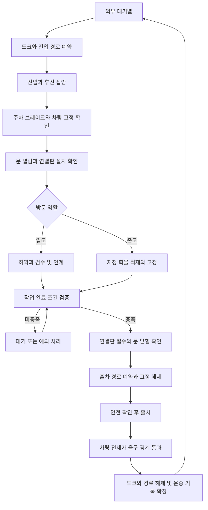

# 입고·출고 트럭과 자동 교대 설계

설계 기준일: **2026-10-10**. **자동 교대는 아직 구현되지 않았다.**

| 현재 구현 | 이 문서의 구현 예정 범위 |
| --- | --- |
| 정적 박스 트럭 1대, 열린 적재함, 물리 상자 48개, 플레이어 운반 | 입고·출고 방문, 도크 예약, 문·연결판·고정 장치, 주행·출차, 다음 차량 진입 |
| 1층 지게차 2대의 독립 자율 작업과 스마트폰 원격 조작 | 트럭 방문과 지게차 작업의 자동 배정·완료 연결 |

현재 트럭의 형상·크기·하중 설정은 [WAREHOUSE.md](WAREHOUSE.md), 에셋 설치는 [TEAM_ASSETS.md](TEAM_ASSETS.md), 상품 생성은 [CARGO_RULES.md](CARGO_RULES.md)에 둔다. 이 문서는 **방문 작업의 완료·출발·교대 조건**을 담당한다.

입고 트럭은 물건을 창고에 인계하고, 출고 트럭은 지정된 물건을 싣고 떠난다. 작업 완료와 출발 허가는 분리한다. 작업이 끝나도 사람·지게차가 트럭이나 출차 경로에 있거나, 연결판·문·차량 고정 장치가 준비되지 않으면 출발하지 않는다. 짐의 실제 위치와 물리 상태를 판정하며, 시간 경과나 단순 개수만으로 완료 처리하지 않는다.

## 도크와 트럭 역할

| 구분 | 입고 | 출고 |
| --- | --- | --- |
| 도크 | 02 | 01 |
| 초기 차량 | 기존 `EXT_ParkedTruck_02`와 적재함의 48개 상자를 입고 방문으로 등록 | 같은 트럭 에셋으로 빈 차량을 추가 |
| 작업 방향 | 트럭 → 검수 → 입고 인계 구역 → 창고 보관 | 창고 재고 → 출고 인계 구역 → 트럭 |
| 완료 기준 | 이번 방문에서 내릴 화물의 검수와 인계 완료 | 이번 출고 명세의 화물 적재와 고정 완료 |
| 다음 차량 | 다음 입고 방문 | 다음 출고 방문 |

처음에는 두 역할을 고정한다. 한 차량이 입고 후 출고 화물을 받는 복합 운행은 별도 작업 명세로 확장할 수 있다. 구현 시 입고·검수 작업자를 남쪽 02번 도크 안쪽 인계 구역으로 옮기고, 포장·출고 준비와 상하차 담당을 01번 도크 근처에 배치한다. 기존 역할 이름표를 유지하고 사람 AI는 추가하지 않는다.

입고·출고 구분은 트럭 방문의 속성이다. 지게차를 역할별 전용으로 고정하지 않고 관제가 현재 두 대 중 가용한 자율 차량에 작업을 배정한다. 같은 팔레트를 두 차량에 동시에 배정하지 않으며, 원격 조작 중인 차량에는 새 자율 작업을 배정하지 않는다. 이미 맡은 작업의 중단·재개는 [AUTONOMY.md](AUTONOMY.md)를 따른다.

## 전체 흐름

예외 상태는 원래 진행 단계와 화물 명세를 보존한다. 해결 후 해당 단계부터 재검증하며, 시간 초과를 이유로 트럭이나 짐을 삭제하고 다음 차량을 넣지 않는다.

## 입고 완료 조건

입고 명세에는 내릴 화물 ID와 수량, 품목, 무게, 전체 생성 규칙 결과를 저장한다. 첫 시나리오는 기존 48개 상자를 그대로 인계 대상으로 사용한다.

다음 조건을 모두 만족해야 입고 작업이 완료된다.

1. 예정 화물 ID마다 검수가 끝나고 창고 측 인수 기록이 있다. 중복 스캔은 한 번만 인정한다.
2. 화물은 트럭 밖의 입고 인계 구역, 창고 보관 위치 또는 창고가 인수한 격리 구역에 실제로 있다. 플레이어가 들고 있거나 마당에 던져 놓은 상태는 인계가 아니다.
3. 기본 시나리오에서는 트럭에 남은 물류가 없다. 인수 완료 화물을 다시 트럭에 넣거나 예정에 없는 물건이 남으면 출발을 막는다.
4. 누락, 미확인 품목과 검수 차이가 해결되었다. 파손 화물을 격리 인수하는 것과 인수를 거절하는 것은 구분한다.
5. 트럭 내부·연결판에서 진행하는 하역 작업이 끝났다.

랙 보관 작업은 입고 인계 이후 계속할 수 있다. 창고 내부의 보관 작업이 남았다는 이유로 트럭을 붙잡지 않는다.

인수 거절 화물을 싣고 돌려보내려면 운영자가 반송 명세를 명시적으로 확정해야 한다. 이때 남아 있는 화물은 승인된 반송 ID와 정확히 일치하고 안전하게 고정되어야 한다. 검수 오류를 자동으로 정상 인수로 바꾸지 않는다.

## 출고 완료 조건

출고 명세는 실제 창고 재고에서 화물 ID를 선택하고 예약한다. 부족한 물건을 트럭 안에 새로 생성하여 주문을 충족시키지 않는다. 첫 시나리오 목표는 48개로 두되, 이후에는 방문별 명세의 수량을 사용한다. 적재함을 빈틈없이 채우는 것이 완료 기준은 아니다.

다음 조건을 모두 만족해야 출고 작업이 완료된다.

1. 지정된 화물 ID가 전부 실제 적재함 안에 있고, 다른 주문 화물이나 미등록 물건이 없다.
2. 화물 전체가 유효 적재 공간 안에 있다. 일부가 문 밖으로 나오거나 플레이어·지게차가 들고 있는 상태는 적재 완료로 세지 않는다.
3. 상자·팔레트·고정 장치의 합산 무게가 차량 정격을 넘지 않고, 적재 배치가 설정된 하중 분포 조건을 만족한다.
4. 파손 금지 화물의 손상이 없고, 적재물이 지지면 위에 안정되어 있다.
5. 필요한 적재 고정이 완료되었고, 짐이 문 닫힘 공간과 충돌하지 않는다.
6. 트럭에서 진행하는 적재 작업과 지게차의 포크 인출이 끝났다.

판정 예시값은 화물 속도 5cm/s 미만, 각속도 5도/s 미만 상태가 시뮬레이션 시간으로 2초 유지되는 것이다. 이는 조정 가능한 교육용 설정이며, 정지했다는 사실만으로 적재 고정을 대신하지 않는다. 출발 직전 실제 상태를 다시 확인한다.

## 공통 출발 조건

| 확인 대상 | 허가 조건 |
| --- | --- |
| 물류 작업 | 해당 방문의 완료 조건 만족, 트럭 측 활성 작업 없음 |
| 사람과 지게차 | 적재함·문 회전 공간·연결판·출차 동선에 사람이나 지게차 부품 없음 |
| 연결판 | 철수 완료, 트럭과 창고 사이를 걸친 짐 없음 |
| 문 | 실제 닫힌 위치와 잠금 확인, 문 공간에 장애물 없음 |
| 적재물 | 명세 일치, 정격 이내, 필요한 고정 유지 |
| 차량 | 고장·비상정지 없음, 운행 준비 완료 |
| 출차 동선 | 출차 예약 획득, 다른 트럭과 동선 충돌 없음 |
| 차량 고정 | 준비 중 주차 브레이크와 고정을 유지하고, 출발 허가 직전에 고정 해제 확인 |

작업 완료는 출발 요청을 생성한다. 연결판 철수와 문 닫힘을 확인한 뒤에도 차량은 고정 상태를 유지한다. 출차 동선이 확보되어야 고정 장치를 해제하고 마지막 안전 검사를 거쳐 이동한다. 이동 중 사람이 들어오거나 짐이 이탈하면 정지하며 물리 시뮬레이션은 계속한다.

## 다음 트럭의 진입 조건

도크는 역할별 대기열을 사용하고 공유 진입·출차 구간은 한 번에 한 차량만 예약한다. 접안해 작업 중인 차량은 이동 경로 예약을 계속 점유하지 않는다. 준비된 출차를 새 진입보다 우선하여 마당이 막히는 것을 줄인다.

다음 트럭은 이전 차량 전체가 출구 경계를 통과하고 도크·공유 경로가 해제된 뒤 진입한다. 도크 공간에 남은 화물이나 사람이 있으면 도크를 비었다고 판정하지 않는다. 새 차량은 짧은 외부 진입 도로의 생성 지점에서 출발해 후진 접안하며, 도크에서 바로 나타나지 않는다.

초기에는 부지 안에 역할별 최대 한 대, 총 두 대만 허용한다. 나머지 방문은 외부 대기 데이터로 보관한다. 도크 해제 후 다음 방문을 준비하고, 기본 도착 지연 15초 뒤 아래 조건이 충족되면 진입시킨다. 지연은 시뮬레이션 시간으로 계산하며 게임 일시정지 중에는 진행하지 않는다.

- 입고: 다음 물량을 인수할 검수·인계 공간이 확보되어 있다. 공간이 부족하면 외부에서 대기한다.
- 출고: 주문 재고와 출고 준비 공간을 확보할 수 있다. 재고 부족이면 대기 사유를 표시한다.
- 공통: 도크, 생성 지점, 진입·후진 경로가 안전하고 공유 경로 예약을 받을 수 있다.

## 화물 기록과 물리 처리

| 기록 | 저장 내용 |
| --- | --- |
| 방문 | 방문 ID, 차량 ID, 입고·출고 역할, 도크, 진행 상태, 대기 사유 |
| 화물 명세 | 예정 화물 ID 집합, 실제 인계·적재 상태, 품목·무게, 검수 결과, 반송 계획 |
| 배송 생성 | 확정된 전체 Recipe와 화물 ID. 공통 필드는 [CARGO_RULES.md](CARGO_RULES.md) 참고 |
| 작업 연결 | 방문과 기존 지게차 작업 ID의 연결, 트럭 측 작업과 창고 내부 작업의 구분 |
| 차량 프로필 | 적재 공간, 공차 중량, 최대 적재 중량, 고정 장치 조건과 하중 분포 기준 |

새 입고 화물은 [공통 화물 생성 규칙](CARGO_RULES.md)을 사용한다. 다음 방문에는 다른 방문 ID와 화물 ID를 부여하고, 차량을 재사용해도 과거 화물 ID를 재사용하지 않는다. 방문 전에 확정된 종류·크기·무게를 공간 부족에 맞춰 도중에 바꾸지 않는다.

출고 화물은 기존 창고 화물 액터를 그대로 옮긴다. 입고를 마친 차량만 제거하고 창고에 남은 인수 화물은 보존한다. 출고 차량이 출구를 통과하면 화물 상태를 운송 중으로 확정하고, 경계 밖 차량·화물 액터를 정리한다. 최종 고객에게 배송 완료된 것으로 기록하지 않는다. 출차 중 이탈한 화물은 도로에 남겨 회수 대상으로 기록한다.

승인된 반송 화물은 반송 운송 중으로 기록한 뒤 차량과 함께 경계 밖에서 정리한다. 차량 정리는 해당 방문의 차체 부품·문·작업등·기록 연결만 해제하며, 다른 방문이나 창고 인수 화물을 함께 삭제하지 않는다.

화물과 팔레트는 운반 중 동적 물리를 유지한다. 적재 고정은 실제 고정 장치나 물리 제약으로 표현하고 강도를 넘어가면 풀리거나 파손될 수 있게 한다. 화물 위치를 트럭에 매번 강제로 맞추거나, 흔들림을 숨기기 위해 물리를 끄지 않는다. 차체·문·바닥 등 한 차량을 구성하는 구조 부품은 같은 차량 구성으로 이동한다.

새 런타임 화물은 손상 시스템에 증분 등록하고, 출구를 통과한 화물은 등록을 해제한다. 이 과정에서 기존 창고의 손상·고장 기록을 초기화하지 않는다. 출발·입고 확인 이벤트는 중복 호출되어도 동일 방문을 한 번만 처리한다.

## 현재 맵과 장비에 맞춘 범위

기존 [트럭 적재함과 하중 설정](WAREHOUSE.md)을 초기 차량 프로필로 재사용하되, 벽·문턱·고정 장치를 제외한 실제 적재 가능 공간을 판정한다. 축하중 해석과 타이어·현가를 포함한 차량 동역학은 별도 구현이 필요하다.

첫 단계는 현재의 낱개 상자 적재와 플레이어 E키 운반을 유지한다. 지게차는 창고와 도크 안쪽의 팔레트 인계 구역을 연결한다. 사람 AI가 없으므로 검수·인수·고정 확인은 플레이어의 작업과 관제 UI로 수행한다.

지게차가 트럭 안까지 들어가는 작업은 차량 바닥과 연결판의 합산 하중, 경사, 폭, 높이, 접촉 조건을 확인한 뒤 추가한다. 트럭 안에서 회전한다고 가정하지 않으며, 외부에서 정렬한 뒤 직선 진입·후진 인출할 수 있는 적재 순서를 사용한다. 현재 모델과 연결판 크기만으로 진입 가능을 보장하지 않는다.

## 예외 상황과 관찰 화면

| 상황 | 동작 |
| --- | --- |
| 마지막 입고 상자가 마당에 떨어짐 | 인계 미완료로 대기, 회수 위치 표시 |
| 적재된 상자를 다시 꺼냄 | 출고 충족 상태 취소, 누락 ID 표시 |
| 다른 주문의 상자를 실음 | 오적재로 출발 차단 |
| 화물 파손이나 누락 | 검수 예외 처리 대기, 자동 보충·삭제 없음 |
| 과적 또는 고정 미완료 | 적재 상태 수정까지 대기 |
| 사람 또는 포크가 연결판에 남음 | 철수·문 닫힘·출발 차단 |
| 출차 중 물건이 미끄러져 떨어짐 | 정지, 이탈·회수 기록 유지, 자동 교대 없음 |
| 다른 트럭이나 사람이 진입로를 막음 | 해당 위치에서 정지, 경로가 비워지면 재검증 |
| 입고 공간 부족 또는 출고 재고 부족 | 다음 방문을 외부 대기열에 유지 |

트럭 위에는 입고·출고 역할과 방문 번호를 표시한다. 관제 메뉴와 전지적 관찰 화면에는 예정/완료 수량, 현재 적재 kg, 도크 상태, 다음 방문과 출발 불가 사유를 표시한다. 수량은 실제 유효 위치와 인수 상태를 기준으로 갱신한다. 대기 시간, 작업 시간, 도크 사용률, 처리량, 과적·오적재·이탈 건수를 방문별로 기록하여 운영 조건을 비교한다.

## 구현 위치와 진행 순서

다음 이름은 구현 예정이며 현재 존재하는 게임 기능을 의미하지 않는다.

| 담당 | 기존 연결점 또는 예정 코드 |
| --- | --- |
| 차량 역할·문·적재 공간·진입과 출차 | 예정 `WarehouseTruck` 액터 |
| 방문 대기열·도크 예약·출발 허가·화물 명세 | 예정 `WarehouseTruckYard` 관리 액터와 방문 데이터 |
| 화물 생성과 식별 | 기존 `WarehouseCargo`와 [CARGO_RULES.md](CARGO_RULES.md) |
| 지게차 작업과 완료 보고 | 기존 `SubmitJob`, `OnJobReport`, [AUTONOMY.md](AUTONOMY.md) |
| 하중과 손상 | 기존 `WarehouseDamageSystem`에 런타임 등록·해제 보강 |
| 도크와 진입 지점 | 기존 `EXT_TruckDockTarget_01/02`, `EXT_TruckEntryTarget`; 출구 지점 추가 |
| 차량 내부 구성 | `Scripts/configure_truck_interior.py`의 단일 정적 트럭 구성을 차량별 구성으로 변경 |
| 역할 표시와 관제 | 기존 PlayerController 메뉴·관찰 카메라와 트럭 상태 UI |

1. 기존 02번 트럭의 48개 화물을 입고 명세로 등록하고, 01번 도크에 빈 출고 차량을 구성한다. 방문별 액터 이름과 소유 범위를 구분하여 다른 트럭의 부품·화물을 삭제하지 않게 한다.
2. 실제 위치를 사용하는 인계·적재 판정과 관제 화면을 먼저 구현한다. 이 단계에서는 출발 요청과 차단 사유를 확인할 수 있게 한다.
3. 문·연결판·차량 고정 상태와 충돌 확인을 연결하고 후진 접안·출차 동선을 구현한다.
4. 출구 통과, 기록 확정, 도크 해제와 다음 방문 생성을 연결한다.
5. 정상 교대와 예외 상황을 반복 검사한 뒤 지속 입고 물량·출고 주문·작업 우선순위를 조정한다.

완료 검사는 정상 입고/출고 교대, 마당에 놓인 마지막 상자, 오적재, 적재 후 화물 제거, 과적, 사람·포크의 잔류, 출차 중 고정 파손, 도크 점유, 재고·공간 부족, 중복 완료 이벤트와 여러 방문의 연속 교대를 포함한다. 인수 화물 보존, 화물 ID 중복 없음, 손상 기록 보존, 이동 중 동적 물리 유지도 함께 확인한다.
